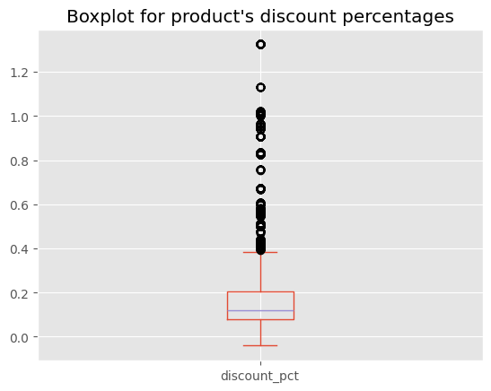
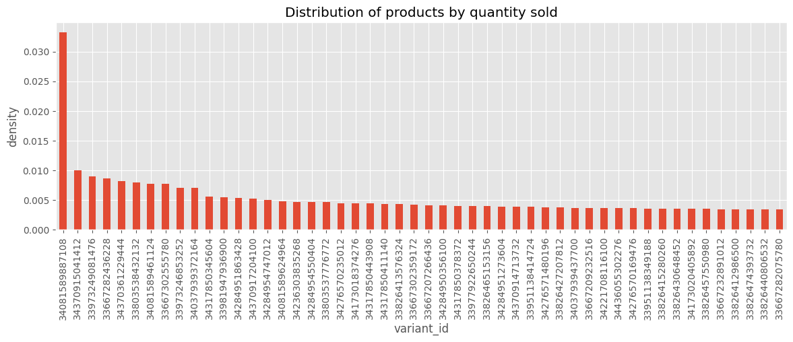
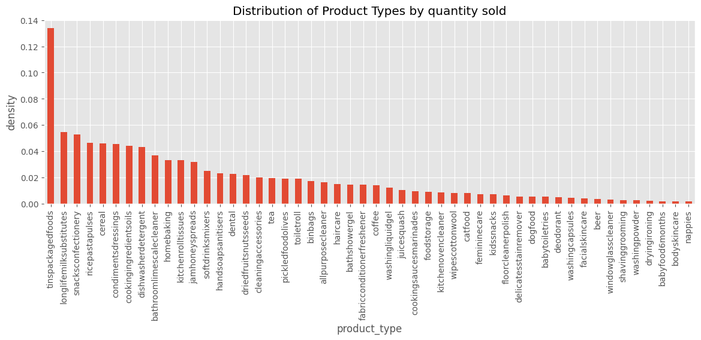
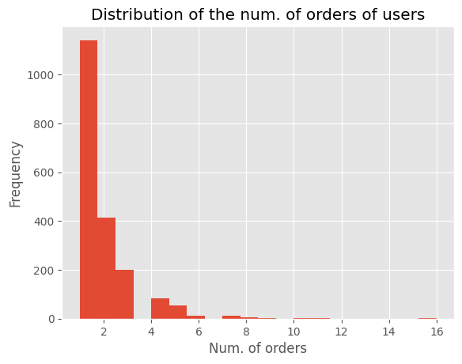
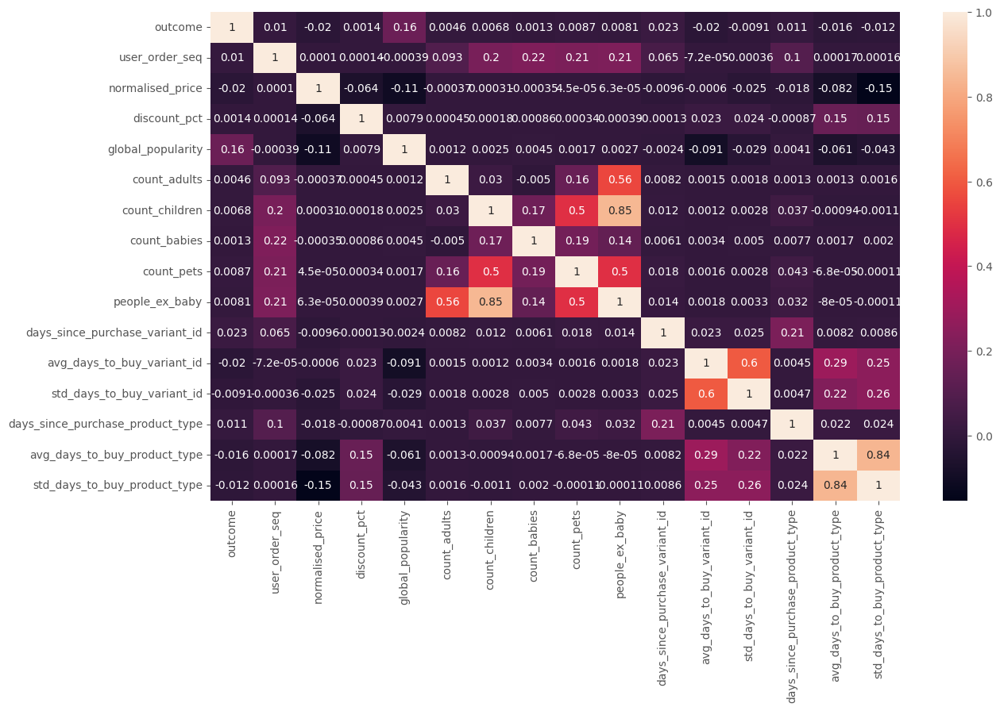
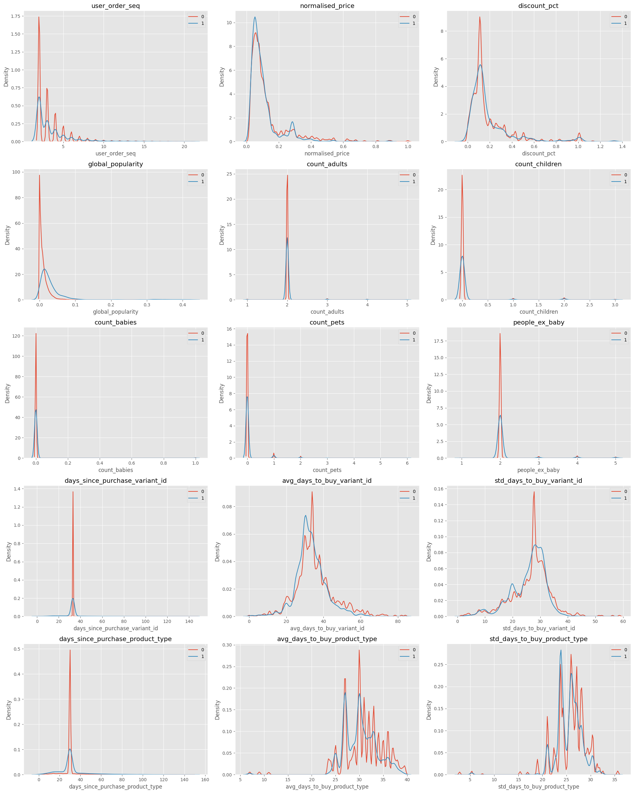

```python
import pandas as pd
import matplotlib.pyplot as plt
import numpy as np
import seaborn as sns

plt.style.use("ggplot")
```


```python
pd.set_option("display.max_columns", 200)
```


```python
data_path = "../../data/"
```


```python
df = pd.read_csv(data_path + "feature_frame.csv")
```


```python
df.info(verbose=True, show_counts=True)
```

    <class 'pandas.core.frame.DataFrame'>
    RangeIndex: 2880549 entries, 0 to 2880548
    Data columns (total 27 columns):
     #   Column                            Non-Null Count    Dtype  
    ---  ------                            --------------    -----  
     0   variant_id                        2880549 non-null  int64  
     1   product_type                      2880549 non-null  object 
     2   order_id                          2880549 non-null  int64  
     3   user_id                           2880549 non-null  int64  
     4   created_at                        2880549 non-null  object 
     5   order_date                        2880549 non-null  object 
     6   user_order_seq                    2880549 non-null  int64  
     7   outcome                           2880549 non-null  float64
     8   ordered_before                    2880549 non-null  float64
     9   abandoned_before                  2880549 non-null  float64
     10  active_snoozed                    2880549 non-null  float64
     11  set_as_regular                    2880549 non-null  float64
     12  normalised_price                  2880549 non-null  float64
     13  discount_pct                      2880549 non-null  float64
     14  vendor                            2880549 non-null  object 
     15  global_popularity                 2880549 non-null  float64
     16  count_adults                      2880549 non-null  float64
     17  count_children                    2880549 non-null  float64
     18  count_babies                      2880549 non-null  float64
     19  count_pets                        2880549 non-null  float64
     20  people_ex_baby                    2880549 non-null  float64
     21  days_since_purchase_variant_id    2880549 non-null  float64
     22  avg_days_to_buy_variant_id        2880549 non-null  float64
     23  std_days_to_buy_variant_id        2880549 non-null  float64
     24  days_since_purchase_product_type  2880549 non-null  float64
     25  avg_days_to_buy_product_type      2880549 non-null  float64
     26  std_days_to_buy_product_type      2880549 non-null  float64
    dtypes: float64(19), int64(4), object(4)
    memory usage: 593.4+ MB


```python
df.head()
```


<div>
<style scoped>
    .dataframe tbody tr th:only-of-type {
        vertical-align: middle;
    }

    .dataframe tbody tr th {
        vertical-align: top;
    }

    .dataframe thead th {
        text-align: right;
    }
</style>
<table border="1" class="dataframe">
  <thead>
    <tr style="text-align: right;">
      <th></th>
      <th>variant_id</th>
      <th>product_type</th>
      <th>order_id</th>
      <th>user_id</th>
      <th>created_at</th>
      <th>order_date</th>
      <th>user_order_seq</th>
      <th>outcome</th>
      <th>ordered_before</th>
      <th>abandoned_before</th>
      <th>active_snoozed</th>
      <th>set_as_regular</th>
      <th>normalised_price</th>
      <th>discount_pct</th>
      <th>vendor</th>
      <th>global_popularity</th>
      <th>count_adults</th>
      <th>count_children</th>
      <th>count_babies</th>
      <th>count_pets</th>
      <th>people_ex_baby</th>
      <th>days_since_purchase_variant_id</th>
      <th>avg_days_to_buy_variant_id</th>
      <th>std_days_to_buy_variant_id</th>
      <th>days_since_purchase_product_type</th>
      <th>avg_days_to_buy_product_type</th>
      <th>std_days_to_buy_product_type</th>
    </tr>
  </thead>
  <tbody>
    <tr>
      <th>0</th>
      <td>33826472919172</td>
      <td>ricepastapulses</td>
      <td>2807985930372</td>
      <td>3482464092292</td>
      <td>2020-10-05 16:46:19</td>
      <td>2020-10-05 00:00:00</td>
      <td>3</td>
      <td>0.0</td>
      <td>0.0</td>
      <td>0.0</td>
      <td>0.0</td>
      <td>0.0</td>
      <td>0.081052</td>
      <td>0.053512</td>
      <td>clearspring</td>
      <td>0.000000</td>
      <td>2.0</td>
      <td>0.0</td>
      <td>0.0</td>
      <td>0.0</td>
      <td>2.0</td>
      <td>33.0</td>
      <td>42.0</td>
      <td>31.134053</td>
      <td>30.0</td>
      <td>30.0</td>
      <td>24.27618</td>
    </tr>
    <tr>
      <th>1</th>
      <td>33826472919172</td>
      <td>ricepastapulses</td>
      <td>2808027644036</td>
      <td>3466586718340</td>
      <td>2020-10-05 17:59:51</td>
      <td>2020-10-05 00:00:00</td>
      <td>2</td>
      <td>0.0</td>
      <td>0.0</td>
      <td>0.0</td>
      <td>0.0</td>
      <td>0.0</td>
      <td>0.081052</td>
      <td>0.053512</td>
      <td>clearspring</td>
      <td>0.000000</td>
      <td>2.0</td>
      <td>0.0</td>
      <td>0.0</td>
      <td>0.0</td>
      <td>2.0</td>
      <td>33.0</td>
      <td>42.0</td>
      <td>31.134053</td>
      <td>30.0</td>
      <td>30.0</td>
      <td>24.27618</td>
    </tr>
    <tr>
      <th>2</th>
      <td>33826472919172</td>
      <td>ricepastapulses</td>
      <td>2808099078276</td>
      <td>3481384026244</td>
      <td>2020-10-05 20:08:53</td>
      <td>2020-10-05 00:00:00</td>
      <td>4</td>
      <td>0.0</td>
      <td>0.0</td>
      <td>0.0</td>
      <td>0.0</td>
      <td>0.0</td>
      <td>0.081052</td>
      <td>0.053512</td>
      <td>clearspring</td>
      <td>0.000000</td>
      <td>2.0</td>
      <td>0.0</td>
      <td>0.0</td>
      <td>0.0</td>
      <td>2.0</td>
      <td>33.0</td>
      <td>42.0</td>
      <td>31.134053</td>
      <td>30.0</td>
      <td>30.0</td>
      <td>24.27618</td>
    </tr>
    <tr>
      <th>3</th>
      <td>33826472919172</td>
      <td>ricepastapulses</td>
      <td>2808393957508</td>
      <td>3291363377284</td>
      <td>2020-10-06 08:57:59</td>
      <td>2020-10-06 00:00:00</td>
      <td>2</td>
      <td>0.0</td>
      <td>0.0</td>
      <td>0.0</td>
      <td>0.0</td>
      <td>0.0</td>
      <td>0.081052</td>
      <td>0.053512</td>
      <td>clearspring</td>
      <td>0.038462</td>
      <td>2.0</td>
      <td>0.0</td>
      <td>0.0</td>
      <td>0.0</td>
      <td>2.0</td>
      <td>33.0</td>
      <td>42.0</td>
      <td>31.134053</td>
      <td>30.0</td>
      <td>30.0</td>
      <td>24.27618</td>
    </tr>
    <tr>
      <th>4</th>
      <td>33826472919172</td>
      <td>ricepastapulses</td>
      <td>2808429314180</td>
      <td>3537167515780</td>
      <td>2020-10-06 10:37:05</td>
      <td>2020-10-06 00:00:00</td>
      <td>3</td>
      <td>0.0</td>
      <td>0.0</td>
      <td>0.0</td>
      <td>0.0</td>
      <td>0.0</td>
      <td>0.081052</td>
      <td>0.053512</td>
      <td>clearspring</td>
      <td>0.038462</td>
      <td>2.0</td>
      <td>0.0</td>
      <td>0.0</td>
      <td>0.0</td>
      <td>2.0</td>
      <td>33.0</td>
      <td>42.0</td>
      <td>31.134053</td>
      <td>30.0</td>
      <td>30.0</td>
      <td>24.27618</td>
    </tr>
  </tbody>
</table>
</div>


```python
df.dtypes
```


    variant_id                            int64
    product_type                         object
    order_id                              int64
    user_id                               int64
    created_at                           object
    order_date                           object
    user_order_seq                        int64
    outcome                             float64
    ordered_before                      float64
    abandoned_before                    float64
    active_snoozed                      float64
    set_as_regular                      float64
    normalised_price                    float64
    discount_pct                        float64
    vendor                               object
    global_popularity                   float64
    count_adults                        float64
    count_children                      float64
    count_babies                        float64
    count_pets                          float64
    people_ex_baby                      float64
    days_since_purchase_variant_id      float64
    avg_days_to_buy_variant_id          float64
    std_days_to_buy_variant_id          float64
    days_since_purchase_product_type    float64
    avg_days_to_buy_product_type        float64
    std_days_to_buy_product_type        float64
    dtype: object


Datatypes seem correct. `created_at` and `order_date` could be changed to\
datetime, though.


```python
df["created_at"] = pd.to_datetime(df["created_at"])
df["order_date"] = pd.to_datetime(df["order_date"])
```


```python
df.isna().sum()
```


    variant_id                          0
    product_type                        0
    order_id                            0
    user_id                             0
    created_at                          0
    order_date                          0
    user_order_seq                      0
    outcome                             0
    ordered_before                      0
    abandoned_before                    0
    active_snoozed                      0
    set_as_regular                      0
    normalised_price                    0
    discount_pct                        0
    vendor                              0
    global_popularity                   0
    count_adults                        0
    count_children                      0
    count_babies                        0
    count_pets                          0
    people_ex_baby                      0
    days_since_purchase_variant_id      0
    avg_days_to_buy_variant_id          0
    std_days_to_buy_variant_id          0
    days_since_purchase_product_type    0
    avg_days_to_buy_product_type        0
    std_days_to_buy_product_type        0
    dtype: int64


No nulls, they may have been imputed.


```python
df.duplicated().sum()
```


    0


```python
df.describe()
```


<div>
<style scoped>
    .dataframe tbody tr th:only-of-type {
        vertical-align: middle;
    }

    .dataframe tbody tr th {
        vertical-align: top;
    }

    .dataframe thead th {
        text-align: right;
    }
</style>
<table border="1" class="dataframe">
  <thead>
    <tr style="text-align: right;">
      <th></th>
      <th>variant_id</th>
      <th>order_id</th>
      <th>user_id</th>
      <th>created_at</th>
      <th>order_date</th>
      <th>user_order_seq</th>
      <th>outcome</th>
      <th>ordered_before</th>
      <th>abandoned_before</th>
      <th>active_snoozed</th>
      <th>set_as_regular</th>
      <th>normalised_price</th>
      <th>discount_pct</th>
      <th>global_popularity</th>
      <th>count_adults</th>
      <th>count_children</th>
      <th>count_babies</th>
      <th>count_pets</th>
      <th>people_ex_baby</th>
      <th>days_since_purchase_variant_id</th>
      <th>avg_days_to_buy_variant_id</th>
      <th>std_days_to_buy_variant_id</th>
      <th>days_since_purchase_product_type</th>
      <th>avg_days_to_buy_product_type</th>
      <th>std_days_to_buy_product_type</th>
    </tr>
  </thead>
  <tbody>
    <tr>
      <th>count</th>
      <td>2.880549e+06</td>
      <td>2.880549e+06</td>
      <td>2.880549e+06</td>
      <td>2880549</td>
      <td>2880549</td>
      <td>2.880549e+06</td>
      <td>2.880549e+06</td>
      <td>2.880549e+06</td>
      <td>2.880549e+06</td>
      <td>2.880549e+06</td>
      <td>2.880549e+06</td>
      <td>2.880549e+06</td>
      <td>2.880549e+06</td>
      <td>2.880549e+06</td>
      <td>2.880549e+06</td>
      <td>2.880549e+06</td>
      <td>2.880549e+06</td>
      <td>2.880549e+06</td>
      <td>2.880549e+06</td>
      <td>2.880549e+06</td>
      <td>2.880549e+06</td>
      <td>2.880549e+06</td>
      <td>2.880549e+06</td>
      <td>2.880549e+06</td>
      <td>2.880549e+06</td>
    </tr>
    <tr>
      <th>mean</th>
      <td>3.401250e+13</td>
      <td>2.978388e+12</td>
      <td>3.750025e+12</td>
      <td>2021-01-13 02:56:12.506720512</td>
      <td>2021-01-12 12:11:14.646395904</td>
      <td>3.289342e+00</td>
      <td>1.153669e-02</td>
      <td>2.113868e-02</td>
      <td>6.092589e-04</td>
      <td>2.290188e-03</td>
      <td>3.629864e-03</td>
      <td>1.272808e-01</td>
      <td>1.862744e-01</td>
      <td>1.070302e-02</td>
      <td>2.017627e+00</td>
      <td>5.492182e-02</td>
      <td>3.538562e-03</td>
      <td>5.134091e-02</td>
      <td>2.072549e+00</td>
      <td>3.312961e+01</td>
      <td>3.523734e+01</td>
      <td>2.645304e+01</td>
      <td>3.143513e+01</td>
      <td>3.088810e+01</td>
      <td>2.594969e+01</td>
    </tr>
    <tr>
      <th>min</th>
      <td>3.361529e+13</td>
      <td>2.807986e+12</td>
      <td>3.046041e+12</td>
      <td>2020-10-05 16:46:19</td>
      <td>2020-10-05 00:00:00</td>
      <td>2.000000e+00</td>
      <td>0.000000e+00</td>
      <td>0.000000e+00</td>
      <td>0.000000e+00</td>
      <td>0.000000e+00</td>
      <td>0.000000e+00</td>
      <td>1.599349e-02</td>
      <td>-4.016064e-02</td>
      <td>0.000000e+00</td>
      <td>1.000000e+00</td>
      <td>0.000000e+00</td>
      <td>0.000000e+00</td>
      <td>0.000000e+00</td>
      <td>1.000000e+00</td>
      <td>0.000000e+00</td>
      <td>0.000000e+00</td>
      <td>1.414214e+00</td>
      <td>0.000000e+00</td>
      <td>7.000000e+00</td>
      <td>2.828427e+00</td>
    </tr>
    <tr>
      <th>25%</th>
      <td>3.380354e+13</td>
      <td>2.875152e+12</td>
      <td>3.745901e+12</td>
      <td>2020-12-16 21:06:58</td>
      <td>2020-12-16 00:00:00</td>
      <td>2.000000e+00</td>
      <td>0.000000e+00</td>
      <td>0.000000e+00</td>
      <td>0.000000e+00</td>
      <td>0.000000e+00</td>
      <td>0.000000e+00</td>
      <td>5.394416e-02</td>
      <td>8.462238e-02</td>
      <td>1.628664e-03</td>
      <td>2.000000e+00</td>
      <td>0.000000e+00</td>
      <td>0.000000e+00</td>
      <td>0.000000e+00</td>
      <td>2.000000e+00</td>
      <td>3.300000e+01</td>
      <td>3.000000e+01</td>
      <td>2.319372e+01</td>
      <td>3.000000e+01</td>
      <td>2.800000e+01</td>
      <td>2.427618e+01</td>
    </tr>
    <tr>
      <th>50%</th>
      <td>3.397325e+13</td>
      <td>2.902856e+12</td>
      <td>3.812775e+12</td>
      <td>2021-01-22 07:36:39</td>
      <td>2021-01-22 00:00:00</td>
      <td>3.000000e+00</td>
      <td>0.000000e+00</td>
      <td>0.000000e+00</td>
      <td>0.000000e+00</td>
      <td>0.000000e+00</td>
      <td>0.000000e+00</td>
      <td>8.105178e-02</td>
      <td>1.169176e-01</td>
      <td>6.284368e-03</td>
      <td>2.000000e+00</td>
      <td>0.000000e+00</td>
      <td>0.000000e+00</td>
      <td>0.000000e+00</td>
      <td>2.000000e+00</td>
      <td>3.300000e+01</td>
      <td>3.400000e+01</td>
      <td>2.769305e+01</td>
      <td>3.000000e+01</td>
      <td>3.100000e+01</td>
      <td>2.608188e+01</td>
    </tr>
    <tr>
      <th>75%</th>
      <td>3.428495e+13</td>
      <td>2.922034e+12</td>
      <td>3.874925e+12</td>
      <td>2021-02-14 18:19:46</td>
      <td>2021-02-14 00:00:00</td>
      <td>4.000000e+00</td>
      <td>0.000000e+00</td>
      <td>0.000000e+00</td>
      <td>0.000000e+00</td>
      <td>0.000000e+00</td>
      <td>0.000000e+00</td>
      <td>1.352670e-01</td>
      <td>2.234637e-01</td>
      <td>1.418440e-02</td>
      <td>2.000000e+00</td>
      <td>0.000000e+00</td>
      <td>0.000000e+00</td>
      <td>0.000000e+00</td>
      <td>2.000000e+00</td>
      <td>3.300000e+01</td>
      <td>4.000000e+01</td>
      <td>3.059484e+01</td>
      <td>3.000000e+01</td>
      <td>3.400000e+01</td>
      <td>2.796118e+01</td>
    </tr>
    <tr>
      <th>max</th>
      <td>3.454300e+13</td>
      <td>3.643302e+12</td>
      <td>5.029635e+12</td>
      <td>2021-03-03 14:42:05</td>
      <td>2021-03-03 00:00:00</td>
      <td>2.100000e+01</td>
      <td>1.000000e+00</td>
      <td>1.000000e+00</td>
      <td>1.000000e+00</td>
      <td>1.000000e+00</td>
      <td>1.000000e+00</td>
      <td>1.000000e+00</td>
      <td>1.325301e+00</td>
      <td>4.254386e-01</td>
      <td>5.000000e+00</td>
      <td>3.000000e+00</td>
      <td>1.000000e+00</td>
      <td>6.000000e+00</td>
      <td>5.000000e+00</td>
      <td>1.480000e+02</td>
      <td>8.400000e+01</td>
      <td>5.868986e+01</td>
      <td>1.480000e+02</td>
      <td>3.950000e+01</td>
      <td>3.564191e+01</td>
    </tr>
    <tr>
      <th>std</th>
      <td>2.786246e+11</td>
      <td>2.446292e+11</td>
      <td>1.775710e+11</td>
      <td>NaN</td>
      <td>NaN</td>
      <td>2.140176e+00</td>
      <td>1.067876e-01</td>
      <td>1.438466e-01</td>
      <td>2.467565e-02</td>
      <td>4.780109e-02</td>
      <td>6.013891e-02</td>
      <td>1.268378e-01</td>
      <td>1.934480e-01</td>
      <td>1.663389e-02</td>
      <td>2.098915e-01</td>
      <td>3.276586e-01</td>
      <td>5.938048e-02</td>
      <td>3.013646e-01</td>
      <td>3.943659e-01</td>
      <td>3.707162e+00</td>
      <td>1.057766e+01</td>
      <td>7.168323e+00</td>
      <td>1.227511e+01</td>
      <td>4.330262e+00</td>
      <td>3.278860e+00</td>
    </tr>
  </tbody>
</table>
</div>


```python
df_bought = df[df["outcome"] == 1.0]
```

Now, I will plot some graphics to understand the distribution of the data


```python
def plot_bar_distribution(df: pd.DataFrame, column: str, title: str):
    plt.figure(figsize=(14, 4))
    df[column].value_counts(normalize=True).iloc[:50].plot(kind="bar")
    plt.title(title)
    plt.xlabel(column)
    plt.ylabel("density")
    plt.show()
```


```python
df_bought["discount_pct"].plot(
    kind="box", title="Boxplot for product's discount percentages"
)
```


    <Axes: title={'center': "Boxplot for product's discount percentages"}>


    

    


```python
df_bought["discount_pct"].sort_values()
```


    1851859   -0.040161
    1852288   -0.040161
    1852249   -0.040161
    1852240   -0.040161
    1851863   -0.040161
                 ...   
    940512     1.325301
    940535     1.325301
    940547     1.325301
    940377     1.325301
    939089     1.325301
    Name: discount_pct, Length: 33232, dtype: float64


How can products have negative discount? What about 132% discount, how is that\
possible? If discount is >=100%, are we giving it for free or as part of a pack\
promotion?


We should ask about if >100% discounts are possible. If not, remove them.


There are a few products that are really popular. Although, it depends on the\
date also, as global_popularity fluctuates.


```python
plot_bar_distribution(
    df_bought, "variant_id", "Distribution of products by quantity sold"
)
```


    

    


There is one specific product that is extremelly popular


```python
df_bought.query("variant_id == 34081589887108").head(3)
```


<div>
<style scoped>
    .dataframe tbody tr th:only-of-type {
        vertical-align: middle;
    }

    .dataframe tbody tr th {
        vertical-align: top;
    }

    .dataframe thead th {
        text-align: right;
    }
</style>
<table border="1" class="dataframe">
  <thead>
    <tr style="text-align: right;">
      <th></th>
      <th>variant_id</th>
      <th>product_type</th>
      <th>order_id</th>
      <th>user_id</th>
      <th>created_at</th>
      <th>order_date</th>
      <th>user_order_seq</th>
      <th>outcome</th>
      <th>ordered_before</th>
      <th>abandoned_before</th>
      <th>active_snoozed</th>
      <th>set_as_regular</th>
      <th>normalised_price</th>
      <th>discount_pct</th>
      <th>vendor</th>
      <th>global_popularity</th>
      <th>count_adults</th>
      <th>count_children</th>
      <th>count_babies</th>
      <th>count_pets</th>
      <th>people_ex_baby</th>
      <th>days_since_purchase_variant_id</th>
      <th>avg_days_to_buy_variant_id</th>
      <th>std_days_to_buy_variant_id</th>
      <th>days_since_purchase_product_type</th>
      <th>avg_days_to_buy_product_type</th>
      <th>std_days_to_buy_product_type</th>
    </tr>
  </thead>
  <tbody>
    <tr>
      <th>85488</th>
      <td>34081589887108</td>
      <td>longlifemilksubstitutes</td>
      <td>2808393957508</td>
      <td>3291363377284</td>
      <td>2020-10-06 08:57:59</td>
      <td>2020-10-06</td>
      <td>2</td>
      <td>1.0</td>
      <td>0.0</td>
      <td>1.0</td>
      <td>0.0</td>
      <td>0.0</td>
      <td>0.284359</td>
      <td>0.138227</td>
      <td>oatly</td>
      <td>0.153846</td>
      <td>2.0</td>
      <td>0.0</td>
      <td>0.0</td>
      <td>0.0</td>
      <td>2.0</td>
      <td>33.0</td>
      <td>25.0</td>
      <td>19.68243</td>
      <td>30.0</td>
      <td>25.0</td>
      <td>21.04899</td>
    </tr>
    <tr>
      <th>85491</th>
      <td>34081589887108</td>
      <td>longlifemilksubstitutes</td>
      <td>2808548917380</td>
      <td>3476645445764</td>
      <td>2020-10-06 14:23:08</td>
      <td>2020-10-06</td>
      <td>5</td>
      <td>1.0</td>
      <td>1.0</td>
      <td>0.0</td>
      <td>0.0</td>
      <td>0.0</td>
      <td>0.284359</td>
      <td>0.138227</td>
      <td>oatly</td>
      <td>0.153846</td>
      <td>2.0</td>
      <td>0.0</td>
      <td>0.0</td>
      <td>0.0</td>
      <td>2.0</td>
      <td>33.0</td>
      <td>25.0</td>
      <td>19.68243</td>
      <td>30.0</td>
      <td>25.0</td>
      <td>21.04899</td>
    </tr>
    <tr>
      <th>85497</th>
      <td>34081589887108</td>
      <td>longlifemilksubstitutes</td>
      <td>2809061539972</td>
      <td>3437017956484</td>
      <td>2020-10-07 08:48:22</td>
      <td>2020-10-07</td>
      <td>14</td>
      <td>1.0</td>
      <td>1.0</td>
      <td>0.0</td>
      <td>0.0</td>
      <td>0.0</td>
      <td>0.284359</td>
      <td>0.138227</td>
      <td>oatly</td>
      <td>0.144737</td>
      <td>2.0</td>
      <td>0.0</td>
      <td>0.0</td>
      <td>0.0</td>
      <td>2.0</td>
      <td>33.0</td>
      <td>25.0</td>
      <td>19.68243</td>
      <td>30.0</td>
      <td>25.0</td>
      <td>21.04899</td>
    </tr>
  </tbody>
</table>
</div>


```python
# Distribution of categorial variables
plot_bar_distribution(
    df_bought, "product_type", "Distribution of Product Types by quantity sold"
)
```


    

    


```python
plot_bar_distribution(
    df_bought, "vendor", "Distribution of vendor's products in orders"
)
```


    

    


```python
df["variant_id"].nunique()
```


    976


```python
df[df["order_id"] == 2918116982916]["outcome"].value_counts()
```


    outcome
    0.0    872
    1.0     10
    Name: count, dtype: int64


In each order, all product id's are included, showing us which were bought\
and which weren't.


```python
df_bought.groupby("user_id")["order_id"].nunique().plot(
    kind="hist",
    bins=20,
    title="Distribution of the num. of orders of users",
    xlabel="Num. of orders",
)
```


    <Axes: title={'center': 'Distribution of the num. of orders of users'}, xlabel='Num. of orders', ylabel='Frequency'>


    

    


## Analysis

- Which features correlate with a product's outcome?
- What to take into account if we want to use this dataset to train a model?


```python
df.columns
```


    Index(['variant_id', 'product_type', 'order_id', 'user_id', 'created_at',
           'order_date', 'user_order_seq', 'outcome', 'ordered_before',
           'abandoned_before', 'active_snoozed', 'set_as_regular',
           'normalised_price', 'discount_pct', 'vendor', 'global_popularity',
           'count_adults', 'count_children', 'count_babies', 'count_pets',
           'people_ex_baby', 'days_since_purchase_variant_id',
           'avg_days_to_buy_variant_id', 'std_days_to_buy_variant_id',
           'days_since_purchase_product_type', 'avg_days_to_buy_product_type',
           'std_days_to_buy_product_type'],
          dtype='object')


```python
target_col = "outcome"
info_cols = ["variant_id", "order_id", "user_id", "created_at", "order_date"]

features_cols = [col for col in df.columns if col not in info_cols + [target_col]]
categorical_cols = ["product_type", "vendor"]
binary_cols = ["ordered_before", "abandoned_before", "active_snoozed", "set_as_regular"]
numerical_cols = [
    col for col in features_cols if col not in categorical_cols + binary_cols
]
```


```python
df[target_col].value_counts()
```


    outcome
    0.0    2847317
    1.0      33232
    Name: count, dtype: int64


```python
for col in binary_cols:
    print(f"Value count {col}: {df[col].value_counts().to_dict()}")
    print(f"Mean outcome by {col} value: {df.groupby(col)[target_col].mean().to_dict()}")
    print()
```

    Value count ordered_before: {0.0: 2819658, 1.0: 60891}
    Mean outcome by ordered_before value: {0.0: 0.008223337723936732, 1.0: 0.1649669080816541}
    
    Value count abandoned_before: {0.0: 2878794, 1.0: 1755}
    Mean outcome by abandoned_before value: {0.0: 0.011106039542947498, 1.0: 0.717948717948718}
    
    Value count active_snoozed: {0.0: 2873952, 1.0: 6597}
    Mean outcome by active_snoozed value: {0.0: 0.011302554809544488, 1.0: 0.1135364559648325}
    
    Value count set_as_regular: {0.0: 2870093, 1.0: 10456}
    Mean outcome by set_as_regular value: {0.0: 0.010668992259135854, 1.0: 0.24971308339709258}
    


Observations:

- There is correlation between the `binary_cols` and the `outcome` because\
  the difference between the outcome depending on whether they have value 0.0 or\
  1.0 is significant.
- The `abandoned_before` has the highest correlation with the `outcome`.
- Both the outcome and feature's values are extremely unbalanced.


```python
df_corr = df[[target_col] + numerical_cols].corr()
plt.figure(figsize=(14, 8))
sns.heatmap(df_corr, annot=True)
```


    <Axes: >


    

    


Observations:
- There is a high correlation between `outcome` and `global_popularity`.\
  `days_since_purchase_product_type` variables. Other variables are somehow\
  correlated with `outcome`.
- Discounts on products have almost no effect on their `outcome`.


```python
ncols = 3
nrows = int(np.ceil(len(numerical_cols)/ncols))
fig, axs = plt.subplots(nrows, ncols, figsize=(20, 5*nrows))
axs = axs.flatten()
for i, col in enumerate(numerical_cols):
    sns.kdeplot(df.loc[lambda x: x.outcome == 0, col], label="0", ax=axs[i])
    sns.kdeplot(df.loc[lambda x: x.outcome == 1, col], label="1", ax=axs[i])
    axs[i].legend()
    axs[i].set_title(col)
plt.tight_layout()
plt.show()
```


    

    


Observations:

- The `count_...` and `days_since_...` columns have extremely pointed shapes.\
  It is likely that there were lots of missing values and they were imputed with\
  the median. If we want to train a model, we have to consider the options of\
  keeping them as they are, or eliminating the columns entirely. If the model\
  with the columns performs better than the one without them, that means that\
  there is useful information there.


```python
df[categorical_cols].describe()
```


<div>
<style scoped>
    .dataframe tbody tr th:only-of-type {
        vertical-align: middle;
    }

    .dataframe tbody tr th {
        vertical-align: top;
    }

    .dataframe thead th {
        text-align: right;
    }
</style>
<table border="1" class="dataframe">
  <thead>
    <tr style="text-align: right;">
      <th></th>
      <th>product_type</th>
      <th>vendor</th>
    </tr>
  </thead>
  <tbody>
    <tr>
      <th>count</th>
      <td>2880549</td>
      <td>2880549</td>
    </tr>
    <tr>
      <th>unique</th>
      <td>62</td>
      <td>264</td>
    </tr>
    <tr>
      <th>top</th>
      <td>tinspackagedfoods</td>
      <td>biona</td>
    </tr>
    <tr>
      <th>freq</th>
      <td>226474</td>
      <td>146828</td>
    </tr>
  </tbody>
</table>
</div>


Observations:
- There are a lot of different values for these categorical features. If we\
  want train a model, we have to encode them. We can try with frequency encoding.
